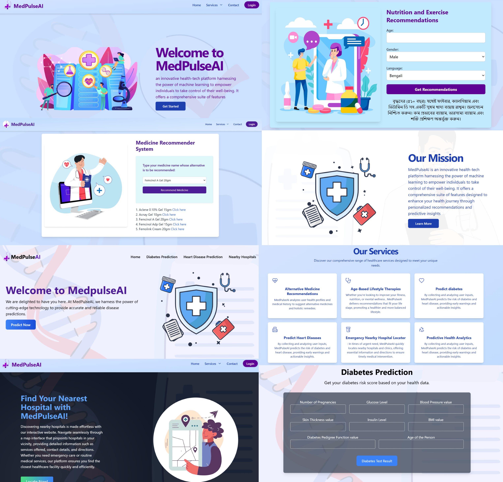

<h1>🩺 MedPulseAI - Your AI-Driven Path to Better Health 🌟</h1>
<h3>💡 Idea </h3>
<br>
Welcome to MedPulseAI, an innovative health-tech platform designed to revolutionize your well-being journey! Harnessing the power of machine learning, MedPulseAI offers a comprehensive suite of features to empower you with personalized health insights and recommendations.

 

<h3>🌟 Features </h3>
Alternative Medicine Recommendations 🌿
Discover safer, natural options with personalized suggestions for alternative medicines and holistic remedies based on your health profile and medical history.

<h3>Age-Based Lifestyle Therapies 🧘‍♂️ </h3>
Get tailored advice for improving fitness, nutrition, and mental wellness, customized to your age and health data for a balanced lifestyle.

<h3>Predictive Health Analytics 🔮 </h3>
Stay ahead of potential health issues with early warnings and actionable insights for diabetes and heart disease, helping you make informed decisions.

<h3>Emergency Hospital Locator 🚑 </h3>
Quickly find nearby hospitals and clinics in emergencies, with essential information and directions for prompt medical intervention.

 <h2>🛠️ Problem It Solves </h2>
Personalized Alternatives: Provides data-driven recommendations for alternative medicine tailored to individual health profiles.
Age-Appropriate Guidance: Offers relevant advice and therapies that evolve with age, enhancing overall well-being.
Early Disease Detection: Predicts chronic conditions like diabetes and heart disease before symptoms arise, allowing for preventive action.
Emergency Preparedness: Ensures quick access to nearby medical facilities during urgent situations.
 <h2>🚧 Challenges We Ran Into </h2>
Data Privacy and Security: Ensuring compliance with GDPR and HIPAA through robust encryption, secure authentication, and regular security audits.
Accurate Machine Learning Models: Developing reliable models for disease prediction and alternative medicine recommendations by gathering comprehensive datasets and collaborating with healthcare professionals.
User Experience Design: Creating an intuitive and user-friendly interface through thorough user research and usability testing.
Integration with External Systems: Collaborating with hospital databases and electronic health records using standardized APIs.
Regulatory Compliance: Staying informed about legal requirements and consulting with experts for clear user disclaimers.
Data Quality Management: Implementing data cleaning processes and regular updates for accurate predictions and recommendations.
User Trust and Adoption: Building trust through transparent communication and offering trials to showcase benefits.
Scalability and Performance: Ensuring efficient handling of growing user numbers and data volumes with scalable infrastructure and optimized algorithms.
Coordination and Maintenance: Effective communication and regular updates incorporating user feedback to maintain ongoing success and relevance.
 <h2>🛠️ Technologies We Used </h2>
Frontend: React, HTML, CSS, TailwindCSS
Backend: Flask, Python, Django
Others: Blockchain, Machine Learning, Artificial Intelligence, API, JavaScript, TypeScript
Database: MongoDB
Version Control: GitHub
🚀 Get Started
To get started with MedPulseAI, clone the repository and follow the setup instructions:

```
Copy code
git clone https://github.com/your-username/medpulseai.git
cd medpulseai
npm install
npm start
